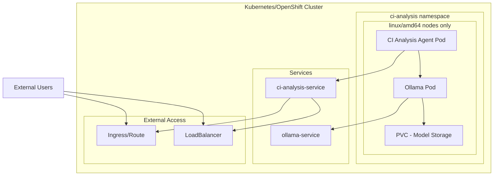

# CI Analysis Agent - Kubernetes & OpenShift Deployment

This document provides comprehensive guidance for deploying the CI Analysis Agent on Kubernetes and OpenShift clusters.

## Table of Contents
- [Prerequisites](#prerequisites)
- [Architecture](#architecture)
- [Kubernetes Deployment](#kubernetes-deployment)
- [OpenShift Deployment](#openshift-deployment)
- [Configuration](#configuration)
- [Monitoring and Troubleshooting](#monitoring-and-troubleshooting)
- [Production Considerations](#production-considerations)

## Prerequisites

### General Requirements
- **Node Architecture**: linux/amd64 nodes (required for Ollama and model compatibility)
- Docker or Podman for building images
- kubectl or oc CLI tools
- At least 10GB of available storage for model data

### Kubernetes Requirements
- Kubernetes 1.20+
- Ingress controller (nginx, traefik, etc.)
- kubectl configured with cluster access

### OpenShift Requirements
- **OpenShift 4.19+** (includes enhanced security contexts)
- oc CLI tool configured with cluster access
- OpenShift Routes for external access

## Architecture



The deployment consists of:
- **CI Analysis Agent**: Main application running ADK framework
- **Ollama Service**: Local LLM inference engine
- **Model Storage**: Persistent volume for model data
- **Security**: Non-root containers with OpenShift SCCs
- **Node Selection**: Ensures scheduling only on linux/amd64 nodes

## Kubernetes Deployment

### Quick Start

```bash
# Clone and navigate to project
git clone <your-repo>
cd ci_analysis_agent

# Deploy to Kubernetes
chmod +x deploy/deploy.sh
./deploy/deploy.sh
```

### Manual Deployment

```bash
# Build Docker image
docker build -t ci-analysis-agent:latest .

# Create namespace and configmap
kubectl apply -f deploy/k8s/namespace.yaml
kubectl apply -f deploy/k8s/configmap.yaml

# Deploy Ollama
kubectl apply -f deploy/k8s/ollama-deployment.yaml
kubectl apply -f deploy/k8s/ollama-service.yaml

# Wait for Ollama and pull model
kubectl wait --for=condition=ready pod -l app=ollama -n ci-analysis --timeout=300s
kubectl apply -f deploy/k8s/ollama-model-job.yaml

# Deploy main application
kubectl apply -f deploy/k8s/ci-analysis-deployment.yaml
kubectl apply -f deploy/k8s/ci-analysis-service.yaml

# Setup external access
kubectl apply -f deploy/k8s/ingress.yaml
```

## OpenShift Deployment

### Quick Start

```bash
# Clone and navigate to project
git clone <your-repo>
cd ci_analysis_agent

# Deploy to OpenShift
chmod +x deploy/deploy-openshift.sh
./deploy/deploy-openshift.sh
```

### OpenShift-Specific Features

#### Security Context Constraints
All pods run with OpenShift-compatible security contexts:
- Non-root user (UID: 1001)
- No privilege escalation
- Dropped capabilities
- seccomp runtime profiles

#### Routes vs Ingress
OpenShift uses Routes for external access:
```yaml
apiVersion: route.openshift.io/v1
kind: Route
metadata:
  name: ci-analysis-agent-route
spec:
  host: ci-analysis-agent.apps.cluster.example.com
  to:
    kind: Service
    name: ci-analysis-service
  tls:
    termination: edge
```

#### Node Selection
All deployments include node selectors for linux/amd64:
```yaml
nodeSelector:
  kubernetes.io/arch: amd64
  kubernetes.io/os: linux
```

### Manual OpenShift Deployment

```bash
# Build Docker image
docker build -t ci-analysis-agent:latest .

# Create namespace and configmap
oc apply -f deploy/k8s/namespace.yaml
oc apply -f deploy/k8s/configmap.yaml

# Deploy Ollama
oc apply -f deploy/k8s/ollama-deployment.yaml
oc apply -f deploy/k8s/ollama-service.yaml

# Wait for Ollama and pull model
oc wait --for=condition=ready pod -l app=ollama -n ci-analysis --timeout=300s
oc apply -f deploy/k8s/ollama-model-job.yaml

# Deploy main application
oc apply -f deploy/k8s/ci-analysis-deployment.yaml
oc apply -f deploy/k8s/ci-analysis-service.yaml

# Create OpenShift Route
oc apply -f deploy/k8s/route.yaml
```

## Configuration

### Environment Variables

| Variable | Description | Default |
|----------|-------------|---------|
| `OLLAMA_API_BASE` | Ollama service endpoint | `http://ollama-service:11434` |
| `GOOGLE_GENAI_USE_VERTEXAI` | Disable Vertex AI | `FALSE` |
| `PYTHONPATH` | Python path for imports | `/app` |

### Model Configuration

The system uses `qwen3:4b` model by default. To change:

1. Update `agent.py`: `MODEL = LiteLlm(model="ollama_chat/your-model")`
2. Update `deploy/k8s/ollama-model-job.yaml`: `"name":"your-model"`
3. Redeploy the application

## Monitoring and Troubleshooting

### Health Checks

Both services include health checks:
- **Ollama**: `GET /api/version`
- **CI Analysis Agent**: `GET /`

### Common Issues

#### Pods not scheduling
```bash
# Check node labels
kubectl get nodes --show-labels | grep -E "(arch|os)"

# Verify linux/amd64 nodes are available
kubectl get nodes -l kubernetes.io/arch=amd64,kubernetes.io/os=linux
```

#### Model loading failures
```bash
# Check Ollama logs
kubectl logs -f deployment/ollama -n ci-analysis

# Check model pull job
kubectl logs job/ollama-model-pull -n ci-analysis
```

#### OpenShift security issues
```bash
# Check security context constraints
oc get scc

# Verify pod security context
oc describe pod -l app=ci-analysis-agent -n ci-analysis
```

### Debugging Commands

```bash
# Kubernetes
kubectl get pods -n ci-analysis
kubectl logs -f deployment/ci-analysis-agent -n ci-analysis
kubectl exec -it deployment/ci-analysis-agent -n ci-analysis -- /bin/bash

# OpenShift
oc get pods -n ci-analysis
oc logs -f deployment/ci-analysis-agent -n ci-analysis
oc rsh deployment/ci-analysis-agent
```

## Production Considerations

### Resource Requirements

#### Minimum Resources
- **CI Analysis Agent**: 1 CPU, 2GB RAM
- **Ollama**: 2 CPU, 8GB RAM
- **Storage**: 20GB for models

#### Production Resources
- **CI Analysis Agent**: 2 CPU, 4GB RAM
- **Ollama**: 4 CPU, 16GB RAM
- **Storage**: 50GB+ for multiple models

### Scaling

#### Horizontal Pod Autoscaling
```yaml
apiVersion: autoscaling/v2
kind: HorizontalPodAutoscaler
metadata:
  name: ci-analysis-agent-hpa
spec:
  scaleTargetRef:
    apiVersion: apps/v1
    kind: Deployment
    name: ci-analysis-agent
  minReplicas: 2
  maxReplicas: 10
  metrics:
  - type: Resource
    resource:
      name: cpu
      target:
        type: Utilization
        averageUtilization: 70
```

#### Ollama Scaling
Ollama should typically run as a single instance due to model loading overhead. For high availability:
- Use persistent storage
- Configure pod disruption budgets
- Consider multiple model instances for different use cases

### Security

#### Network Policies
```yaml
apiVersion: networking.k8s.io/v1
kind: NetworkPolicy
metadata:
  name: ci-analysis-network-policy
spec:
  podSelector:
    matchLabels:
      app: ci-analysis-agent
  policyTypes:
  - Ingress
  - Egress
  ingress:
  - from:
    - namespaceSelector:
        matchLabels:
          name: ingress-nginx
    ports:
    - protocol: TCP
      port: 8000
```

#### RBAC (if needed)
```yaml
apiVersion: v1
kind: ServiceAccount
metadata:
  name: ci-analysis-agent
  namespace: ci-analysis
---
apiVersion: rbac.authorization.k8s.io/v1
kind: Role
metadata:
  name: ci-analysis-agent
  namespace: ci-analysis
rules:
- apiGroups: [""]
  resources: ["pods"]
  verbs: ["get", "list"]
```

### Backup and Recovery

#### Model Backup
```bash
# Create backup of model data
kubectl exec deployment/ollama -n ci-analysis -- tar -czf /tmp/models-backup.tar.gz /home/ollama/.ollama
kubectl cp ci-analysis/ollama-pod:/tmp/models-backup.tar.gz ./models-backup.tar.gz
```

#### Configuration Backup
```bash
# Export all configurations
kubectl get all,configmap,secret,pvc -n ci-analysis -o yaml > ci-analysis-backup.yaml
```

### Monitoring Integration

#### Prometheus Metrics
Add monitoring annotations to services:
```yaml
metadata:
  annotations:
    prometheus.io/scrape: "true"
    prometheus.io/port: "8000"
    prometheus.io/path: "/metrics"
```

#### Grafana Dashboard
Create dashboards for:
- Request rates and latency
- Model inference time
- Resource utilization
- Error rates

### Cleanup

#### Kubernetes
```bash
chmod +x deploy/cleanup.sh
./deploy/cleanup.sh
```

#### OpenShift
```bash
chmod +x deploy/cleanup-openshift.sh
./deploy/cleanup-openshift.sh
```

## Support

For issues and questions:
1. Check the troubleshooting section
2. Review pod logs and events
3. Verify node requirements (linux/amd64)
4. Check OpenShift security contexts if applicable
5. File issues in the project repository 