# CI Analysis Agent

## What is it?

This tool is experimentation to find root cause analysis for multi-arch release test failures. It uses Google's Agent Development Kit (ADK) with local LLM models via Ollama to analyze CI/CD pipeline failures and provide intelligent insights.

## Prerequisites

Before getting started, ensure you have the following installed:

### Required Software
- **Python 3.11+** (recommended 3.13)
- **Git** for version control
- **Ollama** for local LLM models
- **Docker/Podman** for containerization
- **Node.js 18+** (for ADK web interface)

### System Requirements
- **RAM**: 8GB minimum, 16GB recommended (for running local LLM models)
- **Storage**: 10GB free space (for models and dependencies)
- **OS**: Linux (recommended), macOS, or Windows with WSL2

## Getting Started

### 1. Clone the Repository

```bash
# Clone your fork
git clone git@github.com:jeffdyoung/ci_analysis_agent.git
cd ci_analysis_agent

# Add upstream remote (optional, for contributing)
git remote add upstream git@github.com:sherine-k/ci_analysis_agent.git
```

### 2. Install Dependencies

#### Install Python Dependencies
```bash
# Create virtual environment (recommended)
python3 -m venv venv
source venv/bin/activate  # On Windows: venv\Scripts\activate

# Install Python packages
pip install -r requirements.txt

# If requirements.txt doesn't exist, install core dependencies:
pip install google-adk litellm drain3 google-cloud-storage python-dotenv
```

#### Install Ollama
```bash
# On Linux/macOS
curl -fsSL https://ollama.com/install.sh | sh

# On Windows (PowerShell)
# Download from https://ollama.com/download/windows

# Start Ollama service
ollama serve
```

#### Install ADK (Agent Development Kit)
```bash
# Install ADK globally
npm install -g @google/adk

# Or install locally
npm install @google/adk
```

### 3. Setup Local LLM Model

```bash
# Pull the qwen3:4b model (recommended)
ollama pull qwen3:4b

# Verify model is available
ollama list

# Test the model (optional)
ollama run qwen3:4b "Hello, how are you?"
```

### 4. Environment Configuration

Create a `.env` file in the project root:

```bash
# For local Ollama models (default)
OLLAMA_API_BASE=http://localhost:11434

# For Google Gemini (alternative)
# GOOGLE_GENAI_USE_VERTEXAI=FALSE
# GOOGLE_API_KEY=your_google_api_key_here

# Optional: Logging level
LOG_LEVEL=INFO
```

### 5. Build the Prow MCP Server

```bash
# Navigate to the _prow_mcp_server directory
cd _prow_mcp_server

# Build the container image
podman build -t mcp-server-template:latest .
# Or with Docker:
# docker build -t mcp-server-template:latest .

# Return to project root
cd ..
```

### 6. Run the Application

#### Option A: Using ADK Web Interface (Recommended)
```bash
# Start the web interface
adk web

# Open your browser to http://localhost:3000
# Select "CI Analysis Agent" from the available agents
```

#### Option B: Command Line Interface
```bash
# Run the agent directly
python agent.py

# Or run specific sub-agents
python _sub_agents/installation_analyst/agent.py
python _sub_agents/mustgather_analyst/agent.py
```

#### Option C: Development Mode
```bash
# Run with auto-reload for development
adk dev

# Or use Python's development server
python -m adk.cli dev
```

## Configuration Options

### Model Configuration
Edit `agent.py` to change the model:
```python
# For local Ollama models
MODEL = LiteLlm(model="ollama_chat/qwen3:4b")

# For other Ollama models
MODEL = LiteLlm(model="ollama_chat/llama3:8b")
MODEL = LiteLlm(model="ollama_chat/codellama:7b")

# For Google Gemini
MODEL = LiteLlm(model="gemini/gemini-1.5-flash")
```

### Log Analysis Configuration
The system uses Drain3 for log pattern detection. Configure in `drain3.ini`:
```ini
[DRAIN]
sim_th = 0.4
depth = 4
max_children = 100
max_clusters = 1000
```

## Usage Examples

### Analyzing CI Failures
1. Upload your CI logs or must-gather files
2. The agent will automatically:
   - Parse and categorize logs
   - Identify failure patterns
   - Provide root cause analysis
   - Suggest remediation steps

### Supported Input Types
- **Prow job logs**
- **OpenShift must-gather archives**
- **Installation logs**
- **Test execution reports**

## Troubleshooting

### Common Issues

#### "Model not found" Error
```bash
# Check if Ollama is running
ollama list

# If model missing, pull it
ollama pull qwen3:4b

# Verify environment variable
echo $OLLAMA_API_BASE
```

#### "Connection refused" Error
```bash
# Start Ollama service
ollama serve

# Check if port 11434 is available
netstat -tlnp | grep 11434
```

#### ADK Web Interface Issues
```bash
# Clear ADK cache
adk cache clear

# Reinstall ADK
npm uninstall -g @google/adk
npm install -g @google/adk
```

#### Python Import Errors
```bash
# Activate virtual environment
source venv/bin/activate

# Reinstall dependencies
pip install --force-reinstall -r requirements.txt
```

### Performance Tips
- Use smaller models (qwen3:4b) for faster responses
- Increase system RAM for better model performance
- Use SSD storage for faster model loading
- Monitor system resources during analysis

## Development

### Project Structure
```
ci_analysis_agent/
├── agent.py                 # Main agent implementation
├── prompt.py               # Agent prompts and instructions
├── __init__.py             # Package initialization
├── requirements.txt        # Python dependencies
├── Dockerfile              # Container image definition
├── _sub_agents/            # Specialized analysis agents
│   ├── installation_analyst/
│   │   ├── __init__.py
│   │   ├── agent.py        # Installation failure analysis
│   │   └── prompt.py       # Installation analysis prompts
│   └── mustgather_analyst/
│       ├── __init__.py
│       ├── agent.py        # Must-gather analysis
│       ├── prompt.py       # Must-gather analysis prompts
│       ├── must_gather.py  # Must-gather utilities
│       ├── drain.py        # Log pattern extraction
│       └── drain3.ini      # Drain3 configuration
├── _prow_mcp_server/       # MCP server for Prow integration
│   ├── mcp_server.py       # MCP server implementation
│   ├── drain.py            # Log pattern extraction
│   ├── drain3.ini          # Drain3 configuration
│   ├── Containerfile       # Container image definition
│   ├── requirements.txt    # Python dependencies
│   ├── mcp.json            # MCP server configuration
│   └── README.md           # MCP server documentation
└── deploy/                 # Deployment configurations
    ├── tekton/             # Tekton pipeline manifests (RECOMMENDED)
    │   ├── pipeline.yaml           # Main CI/CD pipeline
    │   ├── tasks.yaml              # Custom Tekton tasks
    │   ├── rbac.yaml               # Service account and RBAC
    │   ├── triggers.yaml           # GitHub webhook triggers
    │   ├── pipeline-run.yaml       # Pipeline run template
    │   ├── user-examples.yaml      # Multi-user deployment examples
    │   ├── deploy-pipeline.sh      # Legacy deployment script
    │   ├── deploy-user-namespace.sh # User-namespace deployment script
    │   └── README.md               # Tekton pipeline documentation
    ├── k8s/                # DEPRECATED: Legacy manual manifests
    │   └── README.md       # Deprecation notice
    └── README.md           # Deployment overview
```

### Adding New Features
1. Create a new sub-agent in `_sub_agents/`
2. Update the main agent to include the new functionality
3. Add appropriate prompts and instructions
4. Test with sample data

### Contributing
1. Fork the repository
2. Create a feature branch: `git checkout -b feature-name`
3. Make your changes and test thoroughly
4. Submit a pull request to the upstream repository

## Deployment

For production deployment on OpenShift clusters with multi-user support, see the [`deploy/`](deploy/) directory:

### **Tekton Pipeline Deployment (Recommended)**

The CI Analysis Agent uses Tekton pipelines for automated CI/CD with complete multi-user isolation:

```bash
# Deploy for a specific user
cd deploy/tekton
chmod +x deploy-user-namespace.sh
./deploy-user-namespace.sh <username>

# Example: Deploy for user "alice"
./deploy-user-namespace.sh alice
```

### **Multi-User Architecture**

The CI Analysis Agent supports complete multi-user isolation on a single OpenShift cluster:

```mermaid
graph TB
    subgraph "OpenShift Cluster"
        subgraph "ci-analysis-alice namespace"
            A1[Alice's Pipeline]
            A2[Alice's Ollama]
            A3[Alice's CI Analysis Agent]
            A4[Alice's Route<br/>alice-ci-analysis-agent]
        end
        
        subgraph "ci-analysis-bob namespace"
            B1[Bob's Pipeline]
            B2[Bob's Ollama]
            B3[Bob's CI Analysis Agent]
            B4[Bob's Route<br/>bob-ci-analysis-agent]
        end
        
        subgraph "ci-analysis-qa namespace"
            Q1[QA Pipeline]
            Q2[QA Ollama]
            Q3[QA CI Analysis Agent]
            Q4[QA Route<br/>qa-ci-analysis-agent]
        end
        
        subgraph "Persistent Storage"
            PV1[Alice's Model Data]
            PV2[Bob's Model Data]
            PV3[QA Model Data]
        end
        
        A2 --> PV1
        B2 --> PV2
        Q2 --> PV3
    end
    
    subgraph "External Systems"
        GH1[Alice's GitHub Repo]
        GH2[Bob's GitHub Repo]
        GH3[QA GitHub Repo]
        REG[Container Registry<br/>Quay.io]
        U1[Alice's Users]
        U2[Bob's Users]
        U3[QA Users]
    end
    
    GH1 -->|webhook| A1
    GH2 -->|webhook| B1
    GH3 -->|webhook| Q1
    
    A1 -->|push images| REG
    B1 -->|push images| REG
    Q1 -->|push images| REG
    
    U1 -->|access| A4
    U2 -->|access| B4
    U3 -->|access| Q4
    
    style A1 fill:#e1f5fe
    style B1 fill:#e8f5e8
    style Q1 fill:#fff3e0
    style A2 fill:#e1f5fe
    style B2 fill:#e8f5e8
    style Q2 fill:#fff3e0
    style A3 fill:#e1f5fe
    style B3 fill:#e8f5e8
    style Q3 fill:#fff3e0
```



**Key Features:**
- Each user gets isolated namespace: `ci-analysis-<username>`
- Complete resource isolation per user
- Automated GitHub webhook integration
- Zero shared infrastructure
- Persistent model storage per user

**Full documentation**: [deploy/tekton/README.md](deploy/tekton/README.md)

## Support

For issues and questions:
1. Check the troubleshooting section above
2. Search existing issues in the repository
3. Create a new issue with detailed information
4. Include system information and error logs

## License

This project is licensed under the Apache License 2.0 - see the LICENSE file for details.

## 🚀 Multi-User Tekton Pipeline Suite

### Files Created:
- **`deploy/tekton/pipeline.yaml`** - Main pipeline definition with 7 stages (multi-user)
- **`deploy/tekton/tasks.yaml`** - Custom tasks for deployment operations (multi-user)
- **`deploy/tekton/rbac.yaml`** - Service account and RBAC permissions
- **`deploy/tekton/pipeline-run.yaml`** - Example pipeline run configuration
- **`deploy/tekton/triggers.yaml`** - Automated GitHub webhook triggers (multi-user)
- **`deploy/tekton/deploy-pipeline.sh`** - Automated deployment script
- **`deploy/tekton/user-examples.yaml`** - Multi-user deployment examples
- **`deploy/tekton/README.md`** - Comprehensive documentation

### Pipeline Flow:
1. **Git Clone** - Fetches source code from any GitHub repository
2. **Create Namespace** - Sets up user-specific namespaces (`ci-analysis-<username>`)
3. **Build Image** - Builds container image using Buildah (user-tagged)
4. **Deploy Ollama** - Deploys Ollama with persistent storage (per user)
5. **Deploy CI Analysis Agent** - Deploys the main application (per user)
6. **Load Model** - Loads the qwen3:4b model into Ollama
7. **Create Route** - Exposes the application via OpenShift Route (per user)

### Key Features:
- ✅ **Multi-User Support** - Multiple developers on single cluster
- ✅ **Namespace Isolation** - Each user gets their own namespace
- ✅ **Resource Prefixing** - All resources prefixed with user identifier
- ✅ **OpenShift 4.19+ Compatible** - Full security contexts and RBAC
- ✅ **Automated Triggers** - GitHub webhook integration for auto-deployment
- ✅ **Persistent Storage** - Ollama model storage across deployments
- ✅ **Security Hardened** - Non-root containers, minimal permissions
- ✅ **Comprehensive Monitoring** - Full logging and status tracking
- ✅ **Registry Integration** - Supports any container registry (Quay.io default)

### Quick Start:
```bash
# Navigate to tekton directory
cd deploy/tekton

# Deploy all pipeline resources
./deploy-pipeline.sh

# Create registry secret in user namespace
oc create secret docker-registry docker-registry-secret \
  --docker-server=quay.io \
  --docker-username=<your-username> \
  --docker-password=<your-password> \
  --docker-email=<your-email> \
  -n ci-analysis-<username>

# Deploy for user "alice"
./deploy-user-namespace.sh alice

# Monitor progress
tkn pipelinerun logs --last -f -n ci-analysis-alice
```

### Multi-User Deployment:
The pipeline supports multiple users deploying to completely isolated namespaces. Each user gets their own:
- **Namespace**: `ci-analysis-<username>`
- **Pipeline & Tasks**: Deployed in user's namespace
- **Resources**: Prefixed with username (e.g., `alice-ollama`, `bob-ci-analysis-agent`)
- **Routes**: Individual URLs for each deployment
- **Storage**: Isolated persistent volumes
- **Secrets**: Registry credentials in each user namespace

### Automated Deployment:
The pipeline supports GitHub webhooks for automatic deployment on code pushes from any repository. The webhook endpoint automatically creates user-specific deployments based on the repository owner.

The pipeline is production-ready and includes comprehensive error handling, security best practices, and detailed documentation. Perfect for development teams working on the same codebase with different features or environments.