# CI Analysis Agent Deployment

This directory contains Tekton pipeline-based deployment for the CI Analysis Agent with multi-user support.

## 📁 Directory Structure

```
deploy/
├── tekton/                          # Tekton pipeline manifests
│   ├── pipeline.yaml               # Main CI/CD pipeline
│   ├── tasks.yaml                  # Custom Tekton tasks
│   ├── rbac.yaml                   # Service account and RBAC
│   ├── triggers.yaml               # GitHub webhook triggers
│   ├── pipeline-run.yaml           # Pipeline run template
│   ├── user-examples.yaml          # Multi-user deployment examples
│   ├── deploy-pipeline.sh          # Legacy deployment script
│   ├── deploy-user-namespace.sh    # User-namespace deployment script
│   └── README.md                   # Tekton pipeline documentation
├── k8s/                            # DEPRECATED: Legacy manual manifests
│   └── README.md                   # Deprecation notice
└── README.md                       # This file
```

## 🚀 Quick Start

### **Multi-User Tekton Pipeline Deployment**

The CI Analysis Agent now uses **Tekton pipelines** for automated CI/CD with complete **multi-user support**:

```mermaid
flowchart TD
    Start([User Wants to Deploy]) --> Check{Prerequisites<br/>Met?}
    Check -->|No| Install[Install Prerequisites:<br/>• OpenShift 4.19+<br/>• Tekton Pipelines<br/>• Tekton Triggers<br/>• Registry Access]
    Check -->|Yes| Choose{Deployment<br/>Method?}
    Install --> Choose
    
    Choose -->|Automated| Script[Use deploy-user-namespace.sh]
    Choose -->|Manual| Template[Use sed with templates]
    Choose -->|Webhook| Webhook[Configure GitHub webhook]
    
    Script --> RunScript[./deploy-user-namespace.sh alice]
    Template --> ManualSteps[Manual sed commands<br/>Replace NAMESPACE_PLACEHOLDER]
    Webhook --> SetupWebhook[Setup GitHub webhook URL]
    
    RunScript --> CreateSecret[Create Registry Secret<br/>in user namespace]
    ManualSteps --> CreateSecret
    SetupWebhook --> CreateSecret
    
    CreateSecret --> Deploy[Deploy Pipeline Resources<br/>to ci-analysis-alice namespace]
    Deploy --> Monitor[Monitor Pipeline<br/>tkn pipelinerun logs]
    
    Monitor --> Success([✅ Deployment Complete<br/>Alice can access her instance])
    
    subgraph "User Namespace: ci-analysis-alice"
        Resources[📋 Created Resources:<br/>• Pipeline & Tasks<br/>• RBAC & ServiceAccount<br/>• Triggers & Webhook<br/>• Registry Secret]
    end
    
    subgraph "Result"
        URL[🌐 Access URL:<br/>https://alice-ci-analysis-agent<br/>-ci-analysis-alice.apps.cluster.com]
    end
    
    Success --> Resources
    Success --> URL
    
    style Start fill:#e1f5fe
    style Success fill:#e8f5e8
    style Check fill:#fff3e0
    style Choose fill:#f3e5f5
    style Script fill:#e0f2f1
    style Template fill:#fce4ec
    style Webhook fill:#e8eaf6
```



**Automated Deployment (Recommended):**
```bash
# Deploy pipeline for a specific user
cd deploy/tekton
chmod +x deploy-user-namespace.sh
./deploy-user-namespace.sh <username>

# Example: Deploy for user "alice"
./deploy-user-namespace.sh alice
```

### **User-Namespace Architecture**

Each user gets their own isolated deployment:
- **Namespace**: `ci-analysis-<username>`
- **Complete Isolation**: All resources deployed per user
- **No Shared Infrastructure**: Every user has their own pipeline stack
- **Automatic GitHub Integration**: Webhook-triggered deployments

## 📋 Prerequisites

- **OpenShift 4.19+** or **Kubernetes 1.25+**
- **Tekton Pipelines** installed on cluster
- **Tekton Triggers** installed on cluster
- **Node Architecture**: linux/amd64 nodes (required for Ollama)
- **Registry Access**: Quay.io or container registry credentials
- **Storage**: At least 10GB per user for model data

## 🔧 Key Features

- **Multi-User Support**: Complete isolation per user
- **CI/CD Pipeline**: Automated build and deployment
- **GitHub Integration**: Webhook-triggered deployments
- **Security**: Non-root containers (OpenShift compatible)
- **Persistence**: Model data persisted across restarts
- **Health Checks**: Readiness and liveness probes
- **External Access**: OpenShift Routes per user

## 📖 Pipeline Components

The Tekton pipeline includes:
1. **Git Clone** - Checkout source code
2. **Create Namespace** - User-specific namespace creation
3. **Build Image** - Container image build and push
4. **Deploy Ollama** - AI model serving deployment
5. **Deploy Agent** - Main application deployment
6. **Load Model** - Download and configure AI model
7. **Create Route** - External access configuration

## 🆘 Support

If you encounter issues:
1. Check pipeline logs: `tkn pipelinerun logs --last -f -n ci-analysis-<username>`
2. Verify deployments: `oc get all -n ci-analysis-<username>`
3. Check webhook URL: `oc get route ci-analysis-agent-webhook -n ci-analysis-<username>`
4. See detailed documentation: [tekton/README.md](tekton/README.md)

## 🏗️ Migration from K8s Manifests

The previous manual K8s/OpenShift deployment approach has been replaced with this automated Tekton pipeline approach for better CI/CD integration and multi-user support. 