# CI Analysis Agent Tekton Pipeline (Multi-User)

This directory contains a comprehensive Tekton pipeline for building and deploying the CI Analysis Agent with Ollama on OpenShift, designed for **complete multi-user isolation** on a single cluster.

## 🎯 Multi-User Pipeline Features

### **Key Capabilities:**
1. **Parameterized git-url** - Accepts any GitHub repository URL
2. **User-namespace isolation** - Each user deploys to `ci-analysis-<username>`
3. **Resource prefixing** - All resources prefixed with user identifier
4. **Template-based deployment** - Single pipeline definition supports all users
5. **Automated user detection** - GitHub webhooks automatically detect repository owner

### **User-Namespace-Only Architecture:**
- **Complete Isolation**: All resources (pipeline, tasks, RBAC, secrets) deployed in each user's namespace
- **User Namespaces**: Each user gets namespace `ci-analysis-<username>` with complete pipeline stack
- **No Shared Infrastructure**: Zero shared resources or centralized components
- **Template-Based**: All manifests use `NAMESPACE_PLACEHOLDER` for flexible deployment
- **Automatic Deployment**: GitHub webhooks create user-specific deployments

## 📁 Pipeline Files

### **Core Pipeline Components:**
- ✅ **`pipeline.yaml`** - Main 7-stage CI/CD pipeline with user parameters
- ✅ **`tasks.yaml`** - Custom Tekton tasks for namespace creation, deployment, etc.
- ✅ **`rbac.yaml`** - Service account and RBAC permissions template
- ✅ **`triggers.yaml`** - GitHub webhook triggers with automatic user detection
- ✅ **`pipeline-run.yaml`** - Pipeline run template with example parameters

### **Multi-User Support Files:**
- ✅ **`user-examples.yaml`** - Complete deployment examples for multiple users
- ✅ **`deploy-user-namespace.sh`** - **NEW** User-namespace deployment script
- ✅ **`deploy-pipeline.sh`** - Legacy script (template preparation only)
- ✅ **`README.md`** - This comprehensive documentation

## 🚀 Deployment Options

### **Option 1: Automated Script Deployment (Recommended)**

Use the new deployment script for easy per-user setup:

```bash
# Deploy for user "alice"
chmod +x deploy-user-namespace.sh
./deploy-user-namespace.sh alice

# Deploy for user "bob"
./deploy-user-namespace.sh bob

# Deploy for QA team
./deploy-user-namespace.sh qa
```

This script automatically:
- Creates user namespace `ci-analysis-<username>`
- Replaces `NAMESPACE_PLACEHOLDER` with actual namespace
- Deploys all pipeline components
- Provides setup instructions

### **Option 2: Manual Template Deployment**

For advanced users or custom configurations:

```bash
# Create namespace
oc create namespace ci-analysis-alice

# Deploy with namespace replacement
sed 's/NAMESPACE_PLACEHOLDER/ci-analysis-alice/g' rbac.yaml | oc apply -f -
sed 's/NAMESPACE_PLACEHOLDER/ci-analysis-alice/g' tasks.yaml | oc apply -f -
sed 's/NAMESPACE_PLACEHOLDER/ci-analysis-alice/g' pipeline.yaml | oc apply -f -
sed 's/NAMESPACE_PLACEHOLDER/ci-analysis-alice/g' triggers.yaml | oc apply -f -
```

### **Option 3: GitHub Webhook Automation**

For automatic deployments on code changes:

```bash
# Deploy triggers for user
sed 's/NAMESPACE_PLACEHOLDER/ci-analysis-alice/g' triggers.yaml | oc apply -f -

# Get webhook URL
oc get route ci-analysis-agent-webhook -n ci-analysis-alice -o jsonpath='{.spec.host}'
```

## 🏗️ Pipeline Architecture

### **7-Stage CI/CD Pipeline:**

```mermaid
flowchart TD
    Start([GitHub Push/Webhook]) --> Clone[1. Git Clone<br/>📥 Fetch source code]
    Clone --> Namespace[2. Create Namespace<br/>🏗️ ci-analysis-username]
    Namespace --> Build[3. Build Image<br/>📦 Buildah container build]
    Build --> Push[3a. Push Image<br/>📤 Push to registry]
    Push --> Ollama[4. Deploy Ollama<br/>🤖 AI model server + PVC]
    Ollama --> Agent[5. Deploy Agent<br/>🧠 CI Analysis application]
    Agent --> Model[6. Load Model<br/>📥 Download qwen3:4b model]
    Model --> Route[7. Create Route<br/>🌐 External access URL]
    Route --> Success([✅ Deployment Complete])
    
    subgraph "User Resources Created"
        Resources[📋 User-prefixed resources:<br/>• alice-ollama<br/>• alice-ci-analysis-agent<br/>• alice-ci-analysis-service<br/>• alice-ci-analysis-route<br/>• alice-ollama-data PVC]
    end
    
    subgraph "GitHub Integration"
        Webhook[🔗 Webhook URL<br/>github.com/alice/repo<br/>⬇️ Auto-triggers pipeline]
    end
    
    subgraph "Persistent Storage"
        PVC[💾 Model Data<br/>Survives restarts<br/>10GB+ recommended]
    end
    
    Success --> Resources
    Webhook --> Start
    Ollama --> PVC
    
    style Start fill:#e1f5fe
    style Success fill:#e8f5e8
    style Clone fill:#fff3e0
    style Namespace fill:#f3e5f5
    style Build fill:#e0f2f1
    style Ollama fill:#fce4ec
    style Agent fill:#e8eaf6
    style Model fill:#fff8e1
    style Route fill:#e1f5fe
```



**Pipeline Stages:**
1. **Git Clone** - Checkout source code from user repository
2. **Create Namespace** - Ensure user namespace exists
3. **Build Image** - Build and push container image
4. **Deploy Ollama** - Deploy AI model serving with persistence
5. **Deploy Agent** - Deploy main application
6. **Load Model** - Download and configure AI model
7. **Create Route** - Configure external access

### **User Resource Isolation:**
Each user gets their own isolated:
- **Namespace**: `ci-analysis-<username>`
- **Ollama Deployment**: `<username>-ollama`
- **Agent Deployment**: `<username>-ci-analysis-agent`
- **Services**: `<username>-ollama-service`, `<username>-ci-analysis-service`
- **Route**: `<username>-ci-analysis-agent`
- **ConfigMap**: `<username>-ci-analysis-config`
- **PVC**: `<username>-ollama-data`

## 🔧 Setup Requirements

### **Prerequisites:**
- OpenShift 4.19+ with Tekton Pipelines and Triggers
- Container registry access (Quay.io recommended)
- GitHub repository with webhook configuration
- At least 10GB storage per user for AI models

### **Required Secrets (Per User Namespace):**
```bash
# Docker registry secret
kubectl create secret docker-registry docker-registry-secret \
  --docker-server=quay.io \
  --docker-username=<username> \
  --docker-password=<password> \
  --docker-email=<email> \
  -n ci-analysis-<username>

# GitHub webhook secret (update in triggers.yaml)
secretToken: "your-github-webhook-secret-token"
```

## 📊 Monitoring and Troubleshooting

### **Pipeline Monitoring:**
```bash
# Watch pipeline runs
tkn pipelinerun logs --last -f -n ci-analysis-<username>

# Check deployments
oc get all -n ci-analysis-<username>

# Get webhook URL
oc get route ci-analysis-agent-webhook -n ci-analysis-<username>
```

### **Common Issues:**
1. **Namespace Issues**: Ensure `NAMESPACE_PLACEHOLDER` is replaced correctly
2. **RBAC Permissions**: Verify service account has proper permissions
3. **Registry Access**: Check docker registry secret exists
4. **Storage**: Verify persistent volume claims are bound
5. **Webhook**: Confirm GitHub webhook is configured correctly

## 🎉 Production Ready Features

The pipeline is **production-ready** with:
- ✅ **Complete User Isolation** - Zero shared resources
- ✅ **Security** - Non-root containers, proper RBAC
- ✅ **Persistence** - AI models survive restarts
- ✅ **Monitoring** - Health checks and observability
- ✅ **Automation** - GitHub webhook integration
- ✅ **Scalability** - Support for unlimited users
- ✅ **Documentation** - Comprehensive setup guides

Perfect for **multi-user development teams** requiring complete isolation and automated CI/CD! 🚀 